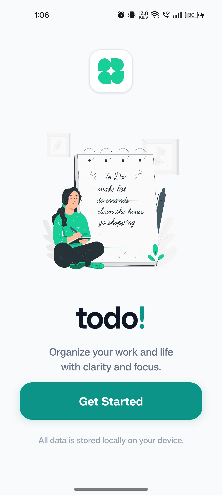
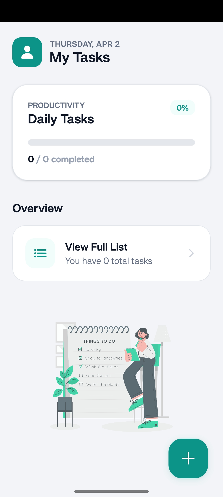
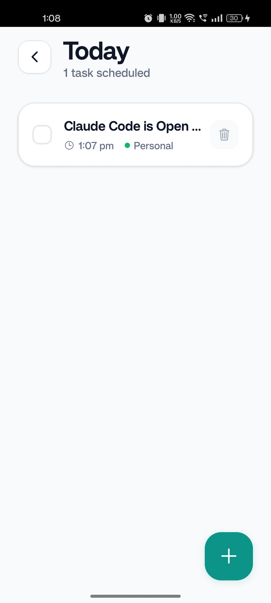
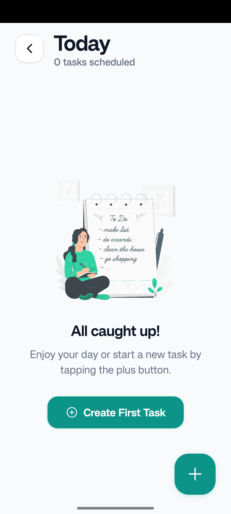

# 📝 TaskMaster: Todo\!

A sleek, **Local-First** mobile task management application built with **React Native** and **Expo**. Designed for speed and privacy, your data never leaves your device.

## 📱 Product Demo

\<div align="center"\>
\<table style="width:100%"\>
\<tr\>
\<td align="center" width="25%"\>
\\<br /\>
\<b\>Landing\</b\>
\</td\>
\<td align="center" width="25%"\>
\\<br /\>
\<b\>Dashboard\</b\>
\</td\>
\<td align="center" width="25%"\>
\\<br /\>
\<b\>Task List\</b\>
\</td\>
\<td align="center" width="25%"\>
\\<br /\>
\<b\>Create Task\</b\>
\</td\>
\</tr\>
\</table\>
\</div\>

-----

## 🚀 Features

  * **Offline-First**: Powered by **Expo SQLite** and **Zustand** for lightning-fast performance without needing an internet connection.
  * **Haptic Feedback**: Premium tactile experience using **Expo Haptics** for interactions.
  * **Task Management**: Create, edit, delete, and toggle tasks with a modern, "bento-box" inspired UI.
  * **Persistent Storage**: Automatic data persistence—your tasks remain even after closing the app.
  * **Responsive Design**: Fully optimized for iOS and Android with a native-feel interface.

-----

## 🛠️ Tech Stack

  * **Framework**: [Expo SDK 55](https://expo.dev/) (React Native 0.83)
  * **State Management**: [Zustand](https://github.com/pmndrs/zustand) (with Persist middleware)
  * **Database**: [Expo SQLite](https://docs.expo.dev/versions/latest/sdk/sqlite/)
  * **Navigation**: [Expo Router v55](https://docs.expo.dev/router/introduction/)
  * **Feedback**: [Expo Haptics](https://docs.expo.dev/versions/latest/sdk/haptics/)
  * **Icons**: [AntDesign](https://icons.expo.fyi/) / [Ionicons](https://ionicons.com/)

-----

## 📦 Getting Started

### 1\. Prerequisites

Ensure you have the following installed:

  * **Node.js**: 18.x or newer (LTS recommended)
  * **Expo Go**: App installed on your [iOS](https://www.google.com/search?q=https://apps.apple.com/app/expo-go/id982107779) or [Android](https://play.google.com/store/apps/details?id=host.exp.exponent) device.

### 2\. Installation

```bash
# Clone the repository
git clone https://github.com/tojiexecodes/todo!.git

# Navigate into the project directory
cd todo!

# Install dependencies
npm install
```

### 3\. Running the App

```bash
npx expo start
```

-----

## 🏗️ Project Structure

```text
├── app/               # Expo Router pages (index, home, today, modal)
├── assets/            # Images, screenshots, and icons
├── components/        # Reusable UI components
├── store/             # Zustand store logic & SQLite persistence
└── scripts/           # Maintenance and reset scripts
```

-----

## 📄 License

Distributed under the **MIT License**. See `LICENSE` for more information.